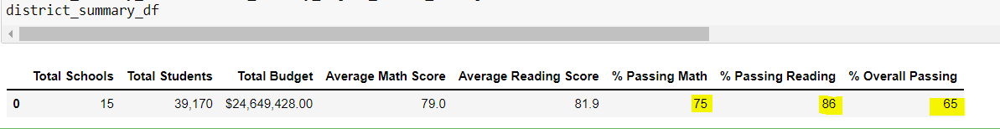
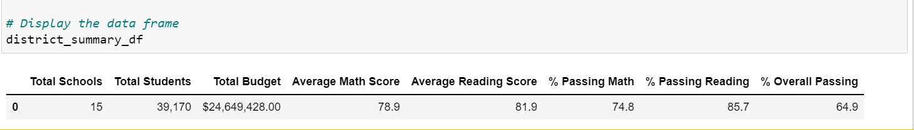
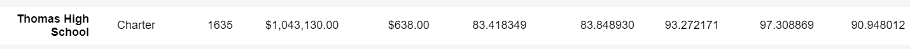
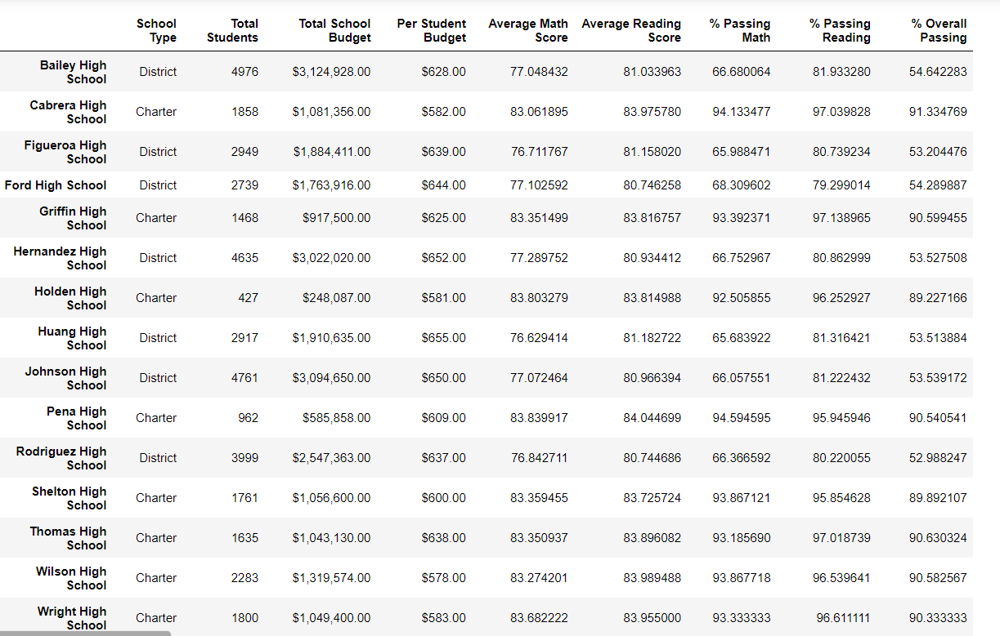

# School District Analysis

## Project Overview:

#### Maria, who is a Chief Data Scientist for a city school district is responsible for analyzing information she gathered from different sources and in different formats. Maria is asked to prepare all standardized test data for analysis, reporting, and presentation to provide insights about performance trends and patterns. These insights will be used to inform discussions and decisions at the school and district levels. 
### In this module we are asked to help Maria analyze data on student funding and students' test scores. Various information is availabe to us from each school, such as students grades, math scores, reading scores, schools sizes', etc.. 
### Our task is to go through the data, analyze it and help explain if there are any trends impacting the schools' performances. Our results will help the schools better understand their budgets and priorities moving forward.
### Once we finished our analysis, we were informed that some of the information initially provided shows evidence of academic dishonety, so we were asked to remove and not consider the math and reading scores for a specific high schoo, "Thomas High School", and keep the rest of the data intact.

## School District Analysis Results:

### How is the district summary affected? 

#### Once the Thomas High School 9th grades math and reading scores were removed from consideration, the new the district summary had a small change to their results.

* The total school counts, total students, and total budgets remained unchanged.
	
* Average Scores changed slightly:

  * Math Scores changed from 79 to 78.9.
  * Reading SCores remained at 81.9.

* % Passing Math, Reading and Overall also slightly changed:
  * % Passing Math dropped from 75.0 74.8.
  * % Passing Reading dropped from 85.8 to 85.7.
  * % Overall Passing dropped from 65.2 to 64.9

### How is the school summary affected?

#### When we replaced all Math and Reading scores for Thomas High School (THS) with NaN values, it automatically lowered the total student number for the school, the intial student count was 39,170, and changed to 38,709 after udpating the values.

#### Also, the average math score, percentage of student passing math, percentage of student passing reading, the overall passing percentage were all impacted.

* Thomas High School Average Scores changed:
  * Average Math Score changed from 83.4 to 83.3
  * Average Reading Score changed from 83.8 to 83.9

* Thomas High School Percentages also changed:
  * % Passing Math dropped from 93.3 to 66.9.
  * % Passing Reading dropped from 97.3 to 69.7.
  * % Overall Passing dropped from 90.9 to 65.1.

#### The below shows the results for the THS when only results for 10th through 12th grades were calculated.

### How does replacing the ninth graders’ math and reading scores affect THS’s performance relative to the other schools?

#### In the initial analysis, Thomas High School was ranked second out of the 15 high shools, based on their overall passing percentage, with an overall passing % at 90.94%. However this percentage dropped all the way to %65.07 once the 9th grade Math and Reading scores were replaced by NaN values. 

#### Initial Performance:

#### NaN Performance:

### How does replacing the ninth-grade scores affect the following:
* Math and reading scores by grade
* Scores by school spending
* Scores by school size
* Scores by school type

#### THS overall passing percentage improved back up to %90.63 once we only considered scores for 10th through 12th grades. New results below,

* % Passing Math increased from 66.9 to 93.2
*	% Passing Reading increased from 69.7 to 97.0
*	% Overall Passing improved 65.1 to 90.3

#### Updated Performance:

### School District Analysis Summary:

### Summarize four changes in the updated school district analysis after reading and math scores for the ninth grade at Thomas High School have been replaced with NaNs.

#### Once we replaced all Math and Reading scores for 9th grade with NaN values, we noticed changes either for the school summary or district', even though they were minimal in some categories, but once we removed 9th grades scores' from the analysis, we noticed that

* THS student counts drastically dropped, as mentioned above.
* Average Math and Reading scores improved.
*	Passing % for Math and Reading both improved.
*	OVerall percentage passing improved.
